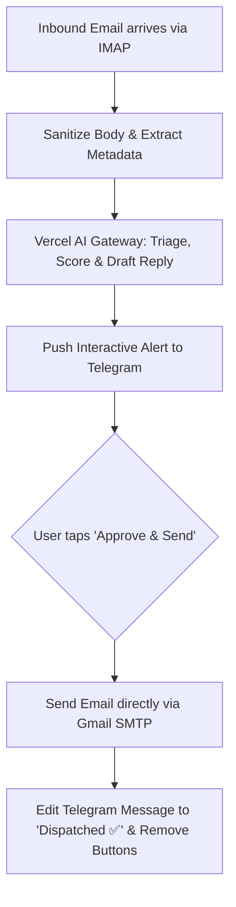

# Autonomous Executive Inbox & Telegram Action Hub (n8n + AI)

An enterprise-ready **Human-in-the-Loop (HITL)** email automation pipeline built with **n8n**, **Vercel AI Gateway**, **Telegram Bot API**, and **Gmail**.

Incoming emails are intercepted, sanitized, evaluated for urgency and intent by an LLM via Vercel AI Gateway, and pushed as interactive notifications to Telegram. With one tap on `[🚀 Approve & Send Reply]`, the drafted response is dispatched back to the sender via SMTP.

---

## 📁 Repository Structure

```
├── docker-compose.yml                     # n8n container service with persistent SQLite volume
├── .env.example                           # Environment configuration template
├── workflows/
│   ├── autonomous_executive_inbox.json    # Complete all-in-one unified production workflow
│   ├── executive_inbox_triage.json        # Ingestion, sanitization, AI evaluation & Telegram alert
│   └── telegram_action_handler.json       # Telegram callback queries & SMTP reply dispatch
└── docs/
    └── PORTFOLIO_CASE_STUDY.md            # Live case study copy, Loom script & Upwork proposal pitch
```

---

## 🚀 Quick Start Commands

### 1. Clone & Setup Environment
```bash
# Clone the repository
git clone https://github.com/BraveRam/n8n-email.git
cd n8n-email

# Copy the environment template
cp .env.example .env
```

### 2. Configure Credentials in `.env`
Open `.env` and fill in your keys:
```bash
# Vercel AI Gateway (https://ai-gateway.vercel.sh/v1)
VERCEL_AI_GATEWAY_URL=https://ai-gateway.vercel.sh/v1
VERCEL_AI_GATEWAY_API_KEY=your_vercel_ai_gateway_key
DEFAULT_AI_MODEL=xiaomi/mimo-v2.6-flash # or anthropic/claude-3-5-sonnet, openai/gpt-4o

# Telegram Bot
TELEGRAM_BOT_TOKEN=your_telegram_bot_token
TELEGRAM_CHAT_ID=your_telegram_chat_id
```

### 3. Expose Webhook Tunnel (For Local Development)
Telegram requires a public HTTPS webhook URL to send button clicks back to your machine:
```bash
# Option A: Using ngrok (Recommended)
ngrok http 5678

# Option B: Using Cloudflare Tunnel
cloudflared tunnel --url http://localhost:5678
```
Copy the generated HTTPS URL (e.g., `https://your-domain.ngrok-free.app/`) and set it in your `.env`:
```bash
WEBHOOK_URL=https://your-domain.ngrok-free.app/
```

### 4. Launch the n8n Container
```bash
docker compose up -d
```
The n8n editor is now live at: **[http://localhost:5678](http://localhost:5678)**

### 5. Import the Workflow & Connect Credentials
1. Open **[http://localhost:5678](http://localhost:5678)**.
2. In the top-right corner, click **`...` (three dots)** $\rightarrow$ **Import from file**.
3. Select `workflows/autonomous_executive_inbox.json`.
4. Connect your credentials:
   - **`Email Trigger (IMAP)`**:
     - Host: `imap.gmail.com` | Port: `993` | SSL: `Enabled`
     - User: your Gmail address | Password: 16-character [Google App Password](https://myaccount.google.com/apppasswords)
   - **`Send Reply via Email (SMTP)`**:
     - Host: `smtp.gmail.com` | Port: `465` | SSL: `Enabled`
     - User: your Gmail address | Password: the same 16-character Google App Password
   - **`Telegram` nodes**:
     - Paste your Telegram Bot Token.
5. In the top-right corner, toggle the switch to **`● Published`**.

---

## 🔄 How the Workflow Operates



---

## 🛡️ Key Architectural Features
- **Human-in-the-Loop Safety:** Guaranteed zero hallucinated emails sent without explicit single-tap approval.
- **Token Efficient:** Strips raw HTML noise and truncates oversized threads before calling the LLM gateway.
- **Provider Agnostic:** Leverages Vercel AI Gateway to swap between Claude 3.5 Sonnet, GPT-4o, and open-source models with zero node rewiring.
- **Idempotent Telegram Controls:** Dynamically modifies the Telegram message upon receipt to prevent duplicate sends.
- **Portfolio & Client Ready:** Complete case study breakdown and client video presentation script in `docs/PORTFOLIO_CASE_STUDY.md`.
